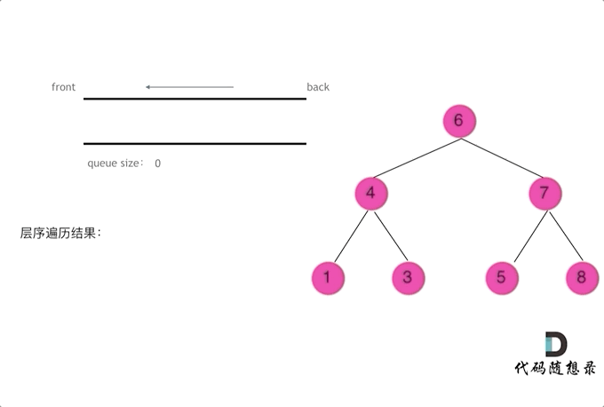

**层序遍历，顾名思义，就是从左到右，一层一层的去遍历二叉树，且遵循的是从左到右的顺序**


> 我们可以用队列存储每层的节点，**队列先进先出，符合一层一层遍历的逻辑**





```cpp
class Solution {
public:
    vector<vector<int>> levelOrder(TreeNode* root) {
        queue<TreeNode*> que;
        if (!root) que.push(root);
        vector<vector<int>> result;
        while (!que.empty) {
            int size = que.size();    //因为放入孩子节点后队列的大小会变化 所以这里需要固定队列的大小
            vector<int> vec;    //存放每一层的结果
            for (int i = 0; i < size; i++) {
                //每次取出头节点
                TreeNode* cur = que.front();
                que.pop();
                vec.push_back(cur->val);
                //空节点不入队列
                if (cur->left) que.psuh(cur->left);
                if (cur->right) que.push(cur->right);
            }
            result.push_back(vec);
        }
        return result;
    }
}
```

