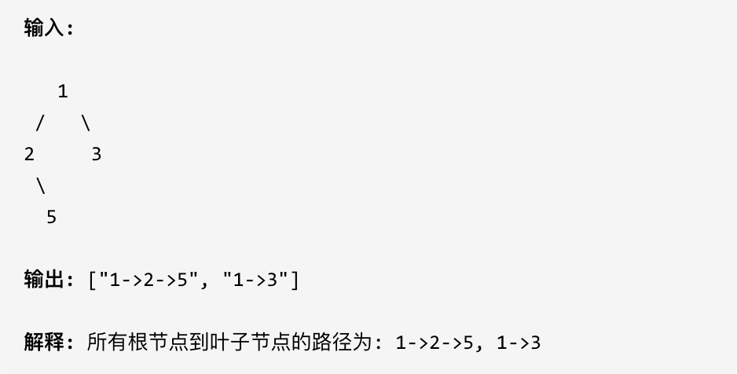

给定一个二叉树，返回所有从根节点到叶子节点的路径。

说明: 叶子节点是指没有子节点的节点。

> 示例: 


**看到返回从根节点到叶子结点的路径，想到前序遍历**

并且此题还涉及回溯。因为我们要把路径记录下来，需要回溯来回退一一个路径在进入另一个路径。

```cpp
class Solution {
public:
    void traversal(TreeNode* cur, string str, vector<string> result) {
        //前序遍历
        if (!cur) return;
        str += to_string(cur->val);
        //如果走到叶子节点
        if (!cur->left && !cur->right) {
            result.push_back(str);
            return;
        }
        if (cur->left) {
            traversal(cur->left, str + "->");
        }
        if (cur->right) {
            traversal(cur->right, str + "->");
        }
    }
    vector<string> binaryTreePaths(TreeNode* root) {
        vector<string> result;
        traversal(root, "", result);
        return result;
    }
};
```

