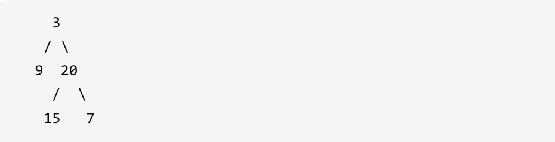

根据一棵树的中序遍历与后序遍历构造二叉树。

注意: 你可以假设树中没有重复的元素。

例如，给出

中序遍历 inorder = [9,3,15,20,7] 后序遍历 postorder = [9,15,7,20,3] 返回如下的二叉树：

首先回忆一下如何根据两个顺序构造一个唯一的二叉树，相信理论知识大家应该都清楚，就是以 后序数组的最后一个元素为切割点，先切中序数组，根据中序数组，反过来在切后序数组。一层一层切下去，每次后序数组最后一个元素就是节点元素。

如果让我们肉眼看两个序列，画一棵二叉树的话，应该分分钟都可以画出来。

流程如图：

那么代码应该怎么写呢？

说到一层一层切割，就应该想到了递归。

来看一下一共分几步：

- 第一步：如果数组大小为零的话，说明是空节点了。
- 第二步：如果不为空，那么取后序数组最后一个元素作为节点元素。
- 第三步：找到后序数组最后一个元素在中序数组的位置，作为切割点
- 第四步：切割中序数组，切成中序左数组和中序右数组 （顺序别搞反了，一定是先切中序数组）
- 第五步：切割后序数组，切成后序左数组和后序右数组
- 第六步：递归处理左区间和右区间