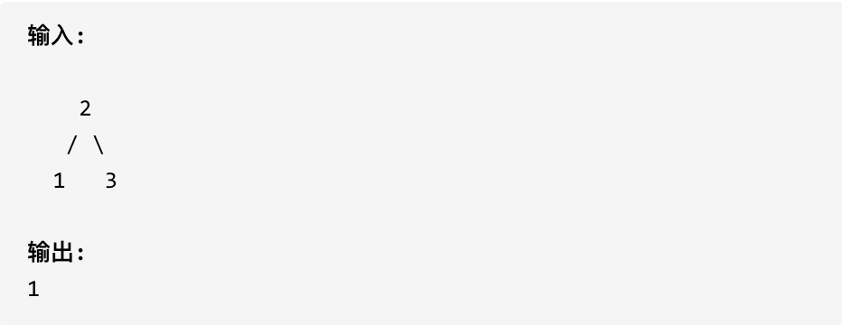

给定一个二叉树，在树的最后一行找到最左边的值。

示例 1:



示例 2:


**最后一行最左边的值，第一眼想到可以用层序遍历，当然也可以递归法**

1.确定递归函数的参数和返回值

```cpp
//一个就是当前节点，一个是当前递归的深度
//还需要两个全局变量来记录最大深度和最左边的值
int maxDepth = INT_MIN;
int result;
void traversal(TreeNode* cur, int depth)
```


2.确定终止条件

```cpp
//当遇到叶子节点时，比较一下当前深度和最大深度来看是否需要更新值
if (!root->left && !root->right) {
    if (depth > maxDepth) {
        maxDepth = depth;
        result = root->val;
    }
    return;
}
```


3.确定单层递归逻辑

```cpp
if (root->left) {
    traversal(root->left, depth + 1);
}
if (root->right) {
    traversal(rot->right, depth + 1);
}
return;
```


```cpp
class Solution {
public:
    int maxDepth = INT_Min;
    int result;
    void traversal(TreeNode* cur, int depth) {
        if (!cur->left && !cur->right) {
            if (depth > maxDepth) {
                maxDepth = depth;
                result = cur->val;
            }
            return;
        }
        if (cur->left) {
            traversal(cur->left, depth + 1);
        }
        if (cur->right) {
            traversal(cur->right, depth + 1);
        }
        return;
    }
};
```


