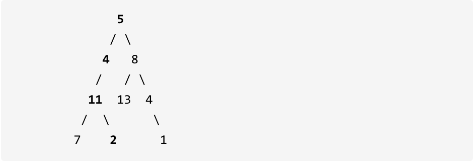

给定一个二叉树和一个目标和，判断该树中是否存在根节点到叶子节点的路径，这条路径上所有节点值相加等于目标和。

说明: 叶子节点是指没有子节点的节点。

示例: 给定如下二叉树，以及目标和 sum = 22，



返回 true, 因为存在目标和为 22 的根节点到叶子节点的路径 5->4->11->2。


**关于递归函数什么时候需要返回值，总结为如下三点**

> * 如果需要搜索整颗二叉树，且不需要处理递归返回值，递归函数就不需要返回值。
>   * 比如你需要求二叉树的所有路径，因为需要搜索整个二叉树，所以不需要递归处理返回值。
> * 如果需要搜索整个二叉树，且需要递归处理返回值，递归函数就需要返回值。
> * 如果只搜索符合其中一条的某个路径，则递归函数需要返回值，因为遇到符合路径需要及时返回。


```cpp
//1.递归函数的参数和返回值
bool traversal(treeNode* cur, int count);
```


**确定终止条件**

首先计数器如何统计这一条路径的和呢？

不要去累加然后判断是否等于目标和，那么代码比较麻烦，可以用递减，让计数器count初始为目标和，然后每次减去遍历路径节点上的数值。

如果最后count == 0，同时到了叶子节点的话，说明找到了目标和。

如果遍历到了叶子节点，count不为0，就是没找到。

递归终止条件代码如下：

```cpp
if (!cur->left && !cur->right && count == 0) return true; // 遇到叶子节点，并且计数为0
if (!cur->left && !cur->right) return false; // 遇到叶子节点而没有找到合适的边，直接返回
```


整体代码如下

```cpp
class Solution {
private:
    bool traversal(TreeNode* cur, int count) {
        if (!cur->left && !cur->right && count == 0) return true; // 遇到叶子节点，并且计数为0
        if (!cur->left && !cur->right) return false; // 遇到叶子节点直接返回

        if (cur->left) { // 左
            count -= cur->left->val; // 递归，处理节点;
            if (traversal(cur->left, count)) return true;
            count += cur->left->val; // 回溯，撤销处理结果
        }
        if (cur->right) { // 右
            count -= cur->right->val; // 递归，处理节点;
            if (traversal(cur->right, count)) return true;
            count += cur->right->val; // 回溯，撤销处理结果
        }
        return false;
    }

public:
    bool hasPathSum(TreeNode* root, int sum) {
        if (root == NULL) return false;
        return traversal(root, sum - root->val);
    }
};
```