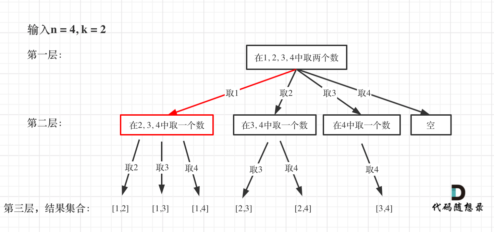

给定两个整数 n 和 k，返回 1 ... n 中所有可能的 k 个数的组合。

示例:
输入: n = 4, k = 2
输出:
[
[2,4],
[3,4],
[2,3],
[1,2],
[1,3],
[1,4],
]

**回溯法的问题都可以抽象为树形结构（N叉树），可以把组合问题抽象如下：**

**每次从集合中选取元素，可选择的范围随着选择的进行而收缩，调整可选择的范围**。

**图中可以发现n相当于树的宽度，k相当于树的深度**。

那么如何在这个树上遍历，然后收集到我们要的结果集呢？

**图中每次搜索到了叶子节点，我们就找到了一个结果**。

相当于只需要把达到叶子节点的结果收集起来，就可以求得 n个数中k个数的组合集合。

然后还需要一个参数，为int型变量startIndex，这个参数用来记录本层递归的中，集合从哪里开始遍历（集合就是[1,...,n] ）。

为什么要有这个startIndex呢？

从下图中红线部分可以看出，在集合[1,2,3,4]取1之后，下一层递归，就要在[2,3,4]中取数了，那么下一层递归如何知道从[2,3,4]中取数呢，靠的就是startIndex。